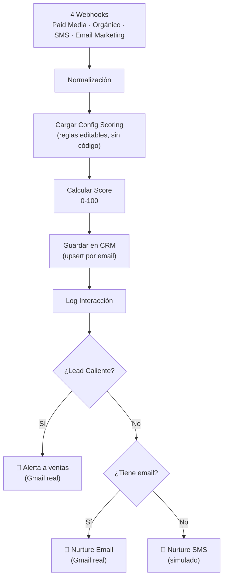
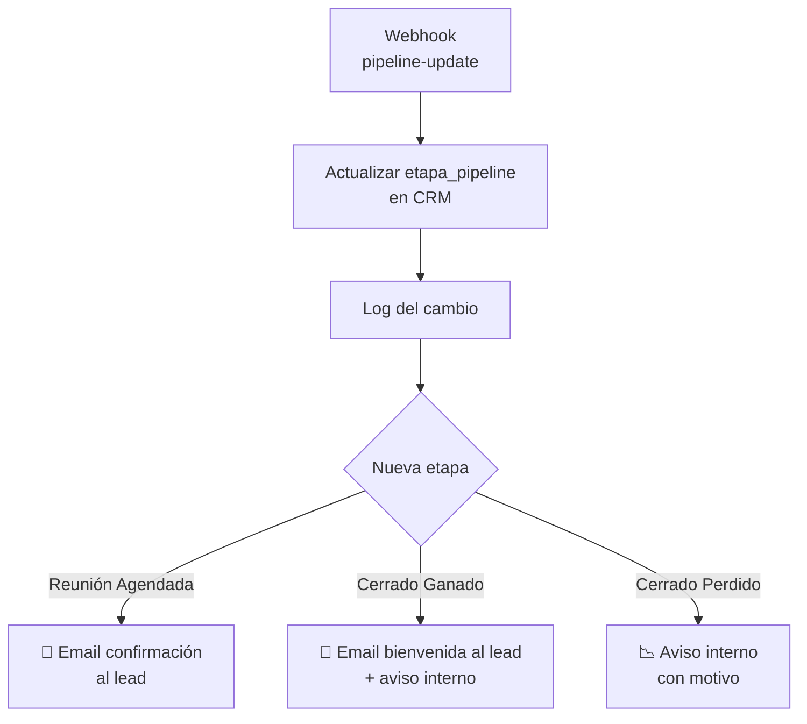

# Lead Generation Multicanal — n8n + GA4 + Pipeline de Ventas

Sistema completo de captación, cualificación y gestión de leads hasta cierre de venta, construido sobre n8n local (ver [n8n-local-lab](https://github.com/carlosarisco55-max/n8n-local-lab) para la infraestructura base: n8n self-hosted, ngrok, Groq). Gratis, replicable a cualquier negocio, probado de punta a punta con ejecuciones y emails reales.

**Repo de infraestructura (prerequisito):** https://github.com/carlosarisco55-max/n8n-local-lab — instala n8n local, ngrok y el nodo de IA gratuita antes de montar esto.

## Qué resuelve

Captura leads desde 4 canales (paid media, orgánico, SMS, email marketing), los enriquece con señales de comportamiento de GA4, los puntúa con reglas configurables (sin tocar código), los guarda en un CRM propio, y los mueve por un pipeline de ventas real hasta Cerrado Ganado/Perdido — con alertas y emails de verdad, no simulados.

## Arquitectura — 2 workflows de n8n

### 1. "Lead Generation — Multicanal"

### 2. "Pipeline de Ventas — Gestión de Etapas"

Etapas del pipeline: `Nuevo → MQL → SQL → Contactado → Reunión Agendada → Propuesta Enviada → Negociación → Cerrado Ganado / Cerrado Perdido`

## Data Tables (el CRM, nativo de n8n, gratis)

- **Leads** — nombre, email, telefono, canal, campana, mensaje, score, etapa (caliente/tibio/frio), etapa_pipeline, fecha, ga_client_id, utm_source, utm_medium, utm_campaign, landing_page, paginas_vistas
- **Interacciones** — histórico de cada contacto/cambio de etapa por lead
- **ConfigScoring** — reglas de puntuación editables (pesos por señal, umbrales, palabras de urgencia, páginas de alta intención) — cambia el comportamiento del scoring sin tocar una línea de código

## GA4 — captura en tiempo real, sin API

**Decisión de diseño clave:** no se usa la Data API de GA4 en tiempo real (no está pensada para consultar a un usuario individual al momento — solo informes agregados o export a BigQuery en lote, 1x/día). En su lugar, el contexto de GA4 se captura **en el propio navegador**, en el momento del formulario:

- `ga_client_id` — de la cookie `_ga`
- `utm_source` / `utm_medium` / `utm_campaign` — de la URL, con persistencia de primer contacto (first-touch attribution) vía `sessionStorage`
- `landing_page` y `paginas_vistas` — comportamiento real antes de convertir

Ver `ga4-lead-capture-snippet.js` — pégalo en cualquier página con formulario, después del tag de GA4, y añade su resultado al payload que mandas al webhook. Cero coste, cero latencia, funciona igual en cualquier negocio con GA4 instalado.

El scoring premia estas señales: +15 si vio 3+ páginas antes de convertir, +15 si aterrizó en una página de alta intención (precios, demo, contacto...) — configurable en la tabla ConfigScoring.

## Seguridad y fiabilidad (añadido tras auditoría, no opcional en producción)

- **Autenticación de webhooks**: los 5 webhooks (4 de captación + pipeline-update) exigen un header `X-Webhook-Secret` con un valor secreto (credencial `httpHeaderAuth` en n8n). Sin él, 403. Cualquier integración real (formulario web, herramienta interna) debe incluir ese header.
- **Manejo de errores**: los nodos de envío de email y escritura en el CRM tienen `onError: continueErrorOutput`, enrutado a un nodo "⚠️ Notificar Error" que avisa por email si algo falla — nada muere en silencio.
- **URL pública estable**: se usa ngrok con dominio fijo reservado a la cuenta (no cambia entre reinicios del túnel).

## Instalación paso a paso

1. Monta primero la infraestructura base: [n8n-local-lab](https://github.com/carlosarisco55-max/n8n-local-lab) (n8n local + ngrok + credencial de IA gratuita)
2. En n8n, crea las 3 Data Tables con las columnas de arriba (Leads, Interacciones, ConfigScoring)
3. Inserta las filas iniciales de configuración en ConfigScoring (pesos y umbrales — ver ejemplo en el código del nodo "Calcular Score" del workflow exportado)
4. Crea una credencial `smtp` con tu Gmail: host `smtp.gmail.com`, puerto 465, `secure: true`, usuario tu email, contraseña una **contraseña de aplicación de Google** (myaccount.google.com/apppasswords, requiere verificación en 2 pasos activada) — no uses tu contraseña normal ni OAuth2 (evita tener que crear una app en Google Cloud)
5. Crea una credencial `httpHeaderAuth` con un secreto aleatorio fuerte, para proteger los webhooks
6. Importa/reconstruye los dos workflows (nodos y conexiones documentados arriba), conecta las credenciales, actívalos
7. Prueba con `test-landing-lead-form.html` (actualiza `WEBHOOK_URL` y `WEBHOOK_SECRET` en el script a los tuyos) — formulario real, con GA4 capturado, mandando al webhook público

## Limitaciones conocidas (decisiones deliberadas, no huecos)

- **SMS real no implementado** — no hay proveedor gratuito real (Twilio cobra por SMS); el nodo de nurture SMS es un placeholder. Activar cuando se acepte ese coste.
- **Dashboard/reporting de atribución** — pendiente como fase 2. Los datos (canal, score, etapa, resultado) ya están listos para ello en las Data Tables; conectar Power BI o un workflow de n8n programado que agregue y reporte.
- **MCP oficial de Google Analytics** (`googleanalytics/google-analytics-mcp`) — instalado pero no configurado (requiere proyecto de Google Cloud + login `gcloud`). Solo hace falta para informes agregados reales vía Claude, no para el enriquecimiento de leads (eso ya funciona sin él).

---
*Construido y probado de extremo a extremo — cada pieza (scoring, CRM, emails, pipeline, seguridad) se verificó con ejecuciones reales antes de darla por buena, incluidos los errores encontrados y corregidos por el camino.*
